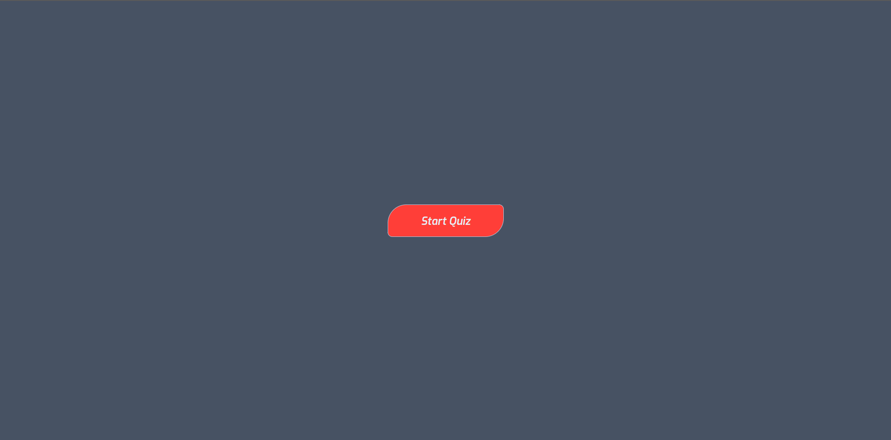

<h1>WebApp<h1>
    <h4>A webapp which has a quiz for the Javascript students in highschool computer club. The test is aimed for the students to answer multiple choice questions on the website.<h4>
 <h2>Demo<h2>
   
The website demo is available on the landing page of the repo
   

<h1>Site<h1>
  <h2>Landing page<h2>
  
     
 The webpage has a start Quiz button that leads to a quiz guide in the next page

   <h2>Mobile Support<h2>
   
The website supports all the devices and all OS's and consistent improvements are being made and updated

<h1>Usage<h1>
   <h2>Development<h2>
   
 Want to contribute? I'm quite sure it is a yes,To fix a bug or enhance an existing module, follow these steps:
  
   
<ul>
      <li>Fork the repo<li>
      <li>Create a new branch <li>
      <li>Make the appropriate changes in the files<li>
      <li>Add changes to reflect the changes made<li>
      <li>Commit your changes <li>
      <li>Push to the branch <li>
      <li>Create a Pull Request<li>
    <ul>

<h2>Bugs<h2>
<h5>If you need to fix a bug kindly inbox me and open up  an issue by including your search query and the expected result<h5>
<h2>Built with<h2>

<h5>HTML<h5>
<h5>Css<h5>
<h5>Javascript<h5>
<h1>License<h1>
<h5>MIT @boniface221<h5>